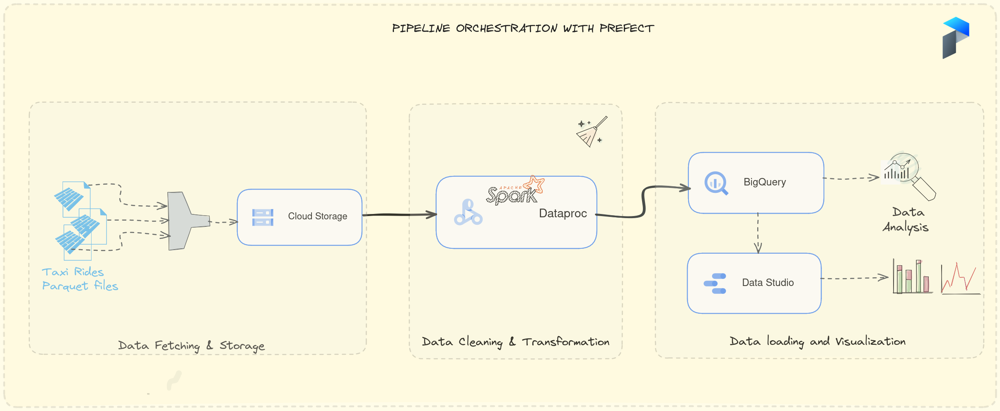

# ETL Pipeline for Yellow Taxi Rides Data

## 💡 Overview

This project involves the development of an ETL (Extract, Transform, Load) pipeline to process yellow taxi rides data provided by the TLC (Taxi and Limousine Commission). The pipeline is designed to fetch raw data from the TLC's web source, store it in a data lake (Google Cloud Storage), perform data transformations using Apache Spark, execute operations in a distributed environment via Dataproc cluster manager, store the cleaned data in a data warehouse (BigQuery), and visualize the results through a dashboard created with Looker Studio. The entire pipeline is orchestrated using Prefect, and the infrastructure is managed on Google Cloud using Terraform.

## 🧰 Technologies Used

   
## 🏛️ Project Structure

The project is structured as follows:

- **Fetching Data:** The ETL pipeline starts by fetching raw yellow taxi rides data from the TLC's web source.
- **Data Storage:** The fetched data is stored in Google Cloud Storage, acting as a data lake.
- **Transformation:** Apache Spark jobs are executed on a Dataproc cluster to apply necessary transformations to the data.
- **Data Warehouse:** The cleaned and transformed data is loaded into BigQuery, serving as the data warehouse.
- **Dashboard Creation:** Data from BigQuery is used to create a visually appealing dashboard using Looker Studio.
- **Orchestration:** Prefect is used to orchestrate the entire pipeline, ensuring smooth execution and monitoring of workflows.
- **Infrastructure as Code:** Terraform is utilized to manage infrastructure on Google Cloud, allowing users to customize and scale the pipeline as needed.

## 🚀 Getting Started

To replicate this project on your end, follow these steps:

    Prerequisites: Ensure you have Google Cloud credentials set up, and necessary API keys and access permissions.

    Clone the Repository: Clone this repository to your local machine.

    bash

git clone https://github.com/your-username/your-repo.git

Configuration: Update configuration files such as config.yaml and provide necessary credentials for Google Cloud.

Run Terraform: Execute Terraform scripts to provision the required infrastructure on Google Cloud.

bash

cd terraform
terraform init
terraform apply

Execute Pipeline: Run the Prefect pipeline to trigger the ETL process.

bash

    cd ../prefect
    python etl_pipeline.py

    Monitor Workflow: Utilize Prefect's monitoring capabilities to keep track of workflow execution.

    Access Dashboard: Once the pipeline is complete, access the Looker Studio dashboard to visualize the results.

Customization

    Scheduling: Modify Prefect workflows to schedule pipeline execution at specific intervals.

    Parallelization: Adjust the number of workers in the Terraform configuration to parallelize the workload based on your requirements.

    Data Range: When executing the pipeline, pass the desired years and months to fetch data for specific time periods.

Contributing

If you'd like to contribute to this project, please fork the repository and create a pull request. Issues and feature requests are also welcome!
License

This project is licensed under the MIT License.
