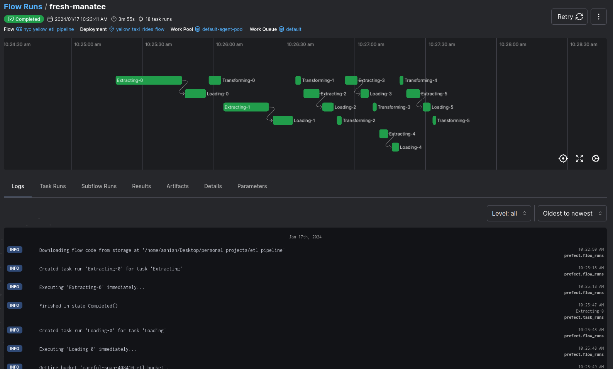
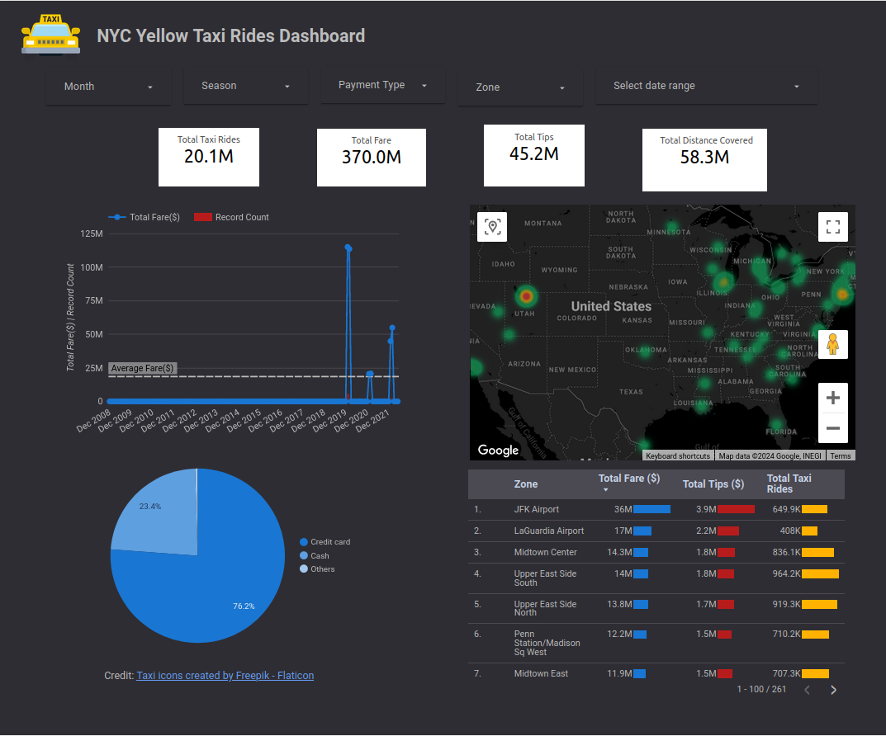

# ETL Pipeline for Yellow Taxi Rides Data

## 💡 Overview

This project involves the development of an ETL (Extract, Transform, Load) pipeline to process yellow taxi rides data provided by the TLC (Taxi and Limousine Commission). The pipeline is designed to fetch raw data from the TLC's web source, store it in a data lake (Google Cloud Storage), perform data transformations using Apache Spark, execute operations in a distributed environment via Dataproc cluster manager, store the cleaned data in a data warehouse (BigQuery), and visualize the results through a dashboard created with Looker Studio. The entire pipeline is orchestrated using Prefect, and the infrastructure is managed on Google Cloud using Terraform.

## 🧰 Technologies Used


### :star: Give a Star! 

Support this project by **giving it a star**. Thanks!

[](https://www.linkedin.com/in/ashish-goyal-00/)
[](https://twitter.com/modifiededition)

   
## 🏛️ Project Structure

The project is structured as follows:

- **Fetching Data:** The ETL pipeline starts by fetching raw yellow taxi rides data from the TLC's web source.
- **Data Storage:** The fetched data is stored in Google Cloud Storage, acting as a data lake.
- **Transformation:** Apache Spark jobs are executed on a Dataproc cluster to apply necessary transformations to the data.
- **Data Warehouse:** The cleaned and transformed data is loaded into BigQuery, serving as the data warehouse.
- **Dashboard Creation:** Data from BigQuery is used to create a visually appealing dashboard using Looker Studio.
- **Orchestration:** Prefect is used to orchestrate the entire pipeline, ensuring smooth execution and monitoring of workflows.
- **Infrastructure as Code:** Terraform is utilized to manage infrastructure on Google Cloud, allowing users to customize and scale the pipeline as needed.


## 🚀 Getting Started

Follow these steps to set up and run the ETL pipeline on your machine:

### Step 1: Prerequisites

Ensure you have the following prerequisites before starting with the pipeline:

- Google Cloud Credentials: Set up Google Cloud credentials with access permissions to services such as storage, storage object, BigQuery, and Dataproc.
- Terraform Installation: Install Terraform on your machine.

### Step 2: Clone Repository

Clone this repository to your local machine

### Step 3: Run Terraform

Execute Terraform scripts to provision the required infrastructure on Google Cloud. Run the following commands:
```bash
terraform init
terraform apply
```

After entering the terraform apply command, you will be prompted for the following information:
- Number of workers required for your Spark job runs managed by the Dataproc cluster.
- Idle time in seconds for the Dataproc cluster (minimum time required is '900s').
- Your Google Cloud Project ID.

> Note: Configure variables in the variable.tf file as needed, such as worker machine type and desired location for hosting cloud services.

### Step 4: Set Up Virtual Environment

Create a virtual environment and install the required libraries from the provided requirements.txt file.

### Step 5: Monitor Workflow

Activate your virtual environment and run the following commands to monitor and execute the pipeline:

Start the Prefect server for monitoring your flow run:

```bash
prefect server start
```
Run the entire pipeline with the following command, specifying the desired years and months for fetching yellow taxi ride data:

```bash
prefect deployment build etl_pipeline:parent_etl_pipeline -n yellow_taxi_rides_flow \
    --params='{"years":["2020","2021"], "months": ["01","02","03"]}' -a
```
In this above example parameters fetch yellow taxi ride data for January, February, and March of 2020 and 2021.

Visit the Prefect server UI (default: localhost:4200) to monitor the flow run.

Execute the flow run by starting an agent from the work pool using the command:

```bash
prefect agent start -p "your_agent_name"
```
> Note: The agent name and command to start an agent will appear on your terminal. Additionally, you have the option to schedule the execution of your pipeline directly from the Prefect UI. Navigate to the deployment section, select your created deployment,and configure the desired schedule, specifying the interval for repetition.

> The below image, showcasing the Prefect monitoring in action:


## Customization

- Scheduling: Modify Prefect workflows to schedule pipeline execution at specific intervals.
- Parallelization: Adjust the number of workers in the Terraform configuration to parallelize the workload based on your requirements.
- Data Range: When executing the pipeline, pass the desired years and months to fetch data for specific time periods.

### Step 6: Access Dashboard

Access Looker Studio and connect it with the table created by the pipeline in BigQuery. Start creating your desired dashboard. Check the provided image below for an example of my created dashboard.



## Contributing

If you'd like to contribute to this project, please fork the repository and create a pull request. Issues and feature requests are also welcome!

## License
This project is licensed under the MIT License.

<a href="https://www.flaticon.com/free-icons/taxi" title="taxi icons">Credit Taxi icons created by Freepik - Flaticon</a>
